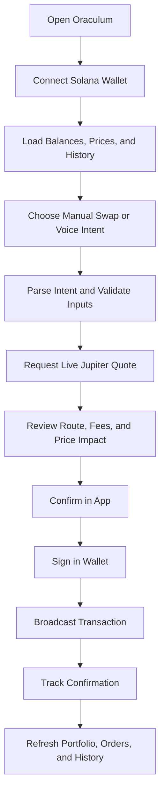

## 1. Product Overview
Oraculum becomes a real, production-oriented Solana trading dapp on Next.js while preserving the current premium terminal-style UI and dashboard structure.
- Main purpose: replace all mocked data and fake wallet behavior with live wallet, portfolio, market, quote, swap, history, and voice-assisted trading flows.
- Product value: ship a credible consumer-facing dapp that looks like the current prototype but behaves like a real Solana trading terminal.

## 2. Core Features

### 2.1 User Roles
| Role | Registration Method | Core Permissions |
|------|---------------------|------------------|
| Trader | Wallet connection | Connect wallet, view live balances, request quotes, execute swaps, review history, use voice-assisted intent flow |

### 2.2 Feature Module
1. **Home page**: command center hero, live wallet summary, live market card, recent activity, AI/voice status, quick swap panel
2. **Portfolio page**: token balances, USD valuation, allocation, PnL snapshot, token-level details
3. **Markets page**: live market list, selected pair metrics, routing and liquidity insights
4. **Orders page**: open and historical swap intents, pending execution states, transaction links
5. **History page**: wallet transaction history, voice commands, executed swaps, execution status
6. **Voice page**: microphone flow, transcript preview, parsed intent, quote preview, execution confirmation
7. **Settings page**: wallet preferences, slippage, priority fee, RPC mode, safety guardrails

### 2.3 Page Details
| Page Name | Module Name | Feature description |
|-----------|-------------|---------------------|
| Home | Protocol header | Shows connected wallet status, network, portfolio headline value, and app health state |
| Home | Quick swap | Requests live Jupiter quote for selected tokens, validates balances, previews fees and price impact |
| Home | Activity rail | Shows recent on-chain activity and app-generated execution events tied to the connected wallet |
| Home | Market card | Displays live pair price, 24h change, liquidity, and routing context |
| Portfolio | Holdings table | Reads SPL token balances, native SOL, metadata, USD prices, allocations, and 24h movement where available |
| Portfolio | Summary cards | Calculates live wallet value, major movers, exposure breakdown, and performance snapshot |
| Markets | Token market list | Pulls live token list and price metrics for supported Solana assets |
| Markets | Pair detail | Shows quote path, estimated output, price impact, liquidity depth, and route venue data |
| Orders | Execution queue | Shows quote requested, awaiting confirmation, submitted, confirmed, failed, and cancelled states |
| Orders | Transaction links | Links every submitted swap to Solscan and local execution record |
| History | Timeline | Merges wallet signature history and app execution events into a single readable timeline |
| Voice | Voice capture | Uses browser speech recognition when available, with typed fallback and explicit review step |
| Voice | Intent resolution | Parses commands into structured actions such as swap, buy, sell, send, or stake-ready placeholders |
| Voice | Execution gate | Requires user confirmation before any on-chain transaction is submitted |
| Settings | Trading controls | Lets user change slippage, priority fee strategy, default quote asset, and confirmation requirements |

## 3. Core Process
Primary user flow:
1. User opens the app and connects a Solana wallet.
2. The app reads live balances, token metadata, prices, and recent transaction history.
3. User chooses a token pair manually or through voice/text intent.
4. The app requests a live Jupiter quote and renders route, output, fee, and impact details.
5. User confirms the transaction in-app, then signs through the wallet provider.
6. The app submits the swap, tracks confirmation status, and refreshes wallet, portfolio, and history views.

## 4. User Interface Design
### 4.1 Design Style
- Primary colors: warm paper, obsidian, muted gold, and selective neon mint highlights
- Button style: refined rounded rectangles with heavy shadows, glass overlays, and terminal-grade microstates
- Fonts and sizes: editorial display serif for headings paired with a clean readable sans for data and controls
- Layout style: desktop-first terminal dashboard with strong side navigation, right rail utilities, and dense but polished cards
- Icon style: thin-line financial terminal iconography with subtle motion and status indicators

### 4.2 Page Design Overview
| Page Name | Module Name | UI Elements |
|-----------|-------------|-------------|
| Home | Overview grid | Layered cards, live numeric counters, animated route highlights, subtle scanline texture |
| Portfolio | Holdings section | Dense financial table, token chips, tabular figures, gain/loss color coding |
| Markets | Price board | Terminal-style list, microcharts, active row glow, venue badges |
| Orders | Execution states | Status pills, route summary chips, timestamped cards, explorer links |
| History | Timeline | Chronological ledger layout, command transcripts, transaction hashes, compact filters |
| Voice | Command surface | Large microphone control, transcript panel, parsed action card, explicit confirmation drawer |
| Settings | Control panels | Sliders, segmented controls, confirmation toggles, RPC health indicators |

### 4.3 Responsiveness
- Desktop-first design is the default.
- Tablet compresses the side rails into collapsible panels while preserving trading density.
- Mobile keeps wallet, quote, and confirmation tasks available through stacked panels and sticky action bars.
- Touch interactions prioritize large confirmation targets and safe transaction review states.

### 4.4 3D Scene Guidance
- No 3D scene is required for v1.
- Visual depth should come from layered shadows, motion, gradients, paper texture, and terminal lighting effects rather than WebGL.

## 5. Delivery Scope
- v1 must include real wallet connection, real balances, real price and quote data, real swap execution, real transaction history, and safe confirmation states.
- v1 should keep voice-assisted trading in beta with transcript review and mandatory manual confirmation before execution.
- v1 excludes custodial accounts, limit orders, cross-chain bridging, staking execution, and database-backed user profiles.
