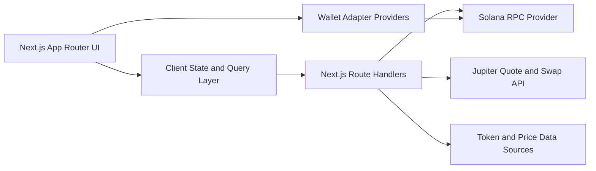
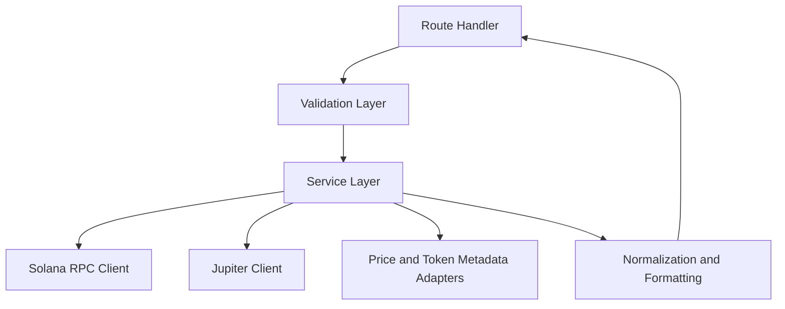
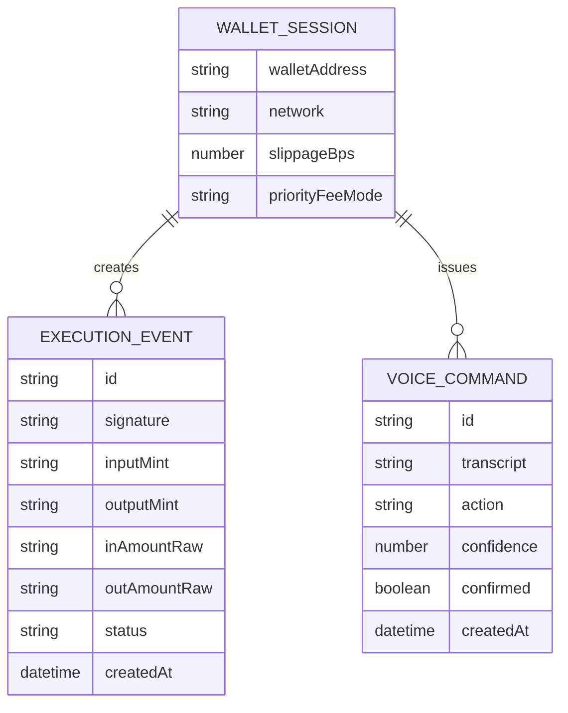

## 1. Architecture Design



## 2. Technology Description

- Frontend: Next.js 15 + React 19 + TypeScript + Tailwind CSS + Framer Motion
- Routing: Next.js App Router with route groups for dashboard sections
- Wallet: `@solana/wallet-adapter-react`, `@solana/wallet-adapter-react-ui`, `@solana/wallet-adapter-wallets`
- Chain Client: `@solana/web3.js`
- Data fetching: TanStack Query for live client caching and invalidation
- Forms and validation: React Hook Form + Zod
- Charts and tables: Recharts plus custom financial table components
- Quote and swap routing: Jupiter API through server-side route handlers
- Speech input: browser Web Speech API where supported, with typed fallback
- Initialization Tool: `create-next-app`

## 3. Route Definitions

| Route                 | Purpose                                                                            |
| --------------------- | ---------------------------------------------------------------------------------- |
| /                     | Home dashboard with wallet overview, quick swap, activity, and live market summary |
| /portfolio            | Live wallet holdings, allocation, valuation, and token-level breakdown             |
| /markets              | Live token list, pair detail, and quote/routing context                            |
| /orders               | Execution states for requested and submitted swaps                                 |
| /history              | Wallet transaction history and app execution ledger                                |
| /voice                | Voice-assisted command capture, intent parsing, quote preview, and confirmation    |
| /settings             | Slippage, priority fee, RPC, and transaction safety preferences                    |
| /api/wallet/balances  | Returns normalized wallet balances and metadata for a public key                   |
| /api/wallet/portfolio | Returns computed portfolio summary with USD values                                 |
| /api/wallet/history   | Returns normalized recent transaction history for a wallet                         |
| /api/markets/list     | Returns tracked token market data and pair-level metrics                           |
| /api/quote            | Proxies and normalizes Jupiter quote requests                                      |
| /api/swap             | Builds swap transaction payloads through Jupiter                                   |
| /api/execute/track    | Tracks submitted transaction confirmation status                                   |
| /api/voice/parse      | Converts transcript or typed command into structured trading intent                |

## 4. API Definitions

### 4.1 Shared Types

```ts
type WalletBalance = {
  mint: string;
  symbol: string;
  name: string;
  decimals: number;
  amountRaw: string;
  amountUi: number;
  usdPrice: number | null;
  usdValue: number | null;
  logoUri?: string;
  isNativeSol: boolean;
};

type PortfolioSummary = {
  walletAddress: string;
  totalUsdValue: number;
  holdings: WalletBalance[];
  topMovers: Array<{
    mint: string;
    symbol: string;
    change24hPct: number | null;
    usdValue: number | null;
  }>;
};

type QuoteRequest = {
  inputMint: string;
  outputMint: string;
  amountRaw: string;
  slippageBps: number;
  walletAddress: string;
};

type QuoteResponse = {
  inputMint: string;
  outputMint: string;
  inAmountRaw: string;
  outAmountRaw: string;
  outAmountUi: number;
  priceImpactPct: number;
  routePlan: Array<{
    label: string;
    percent: number;
  }>;
  estimatedNetworkFeeLamports: number | null;
};

type SwapBuildResponse = {
  swapTransactionBase64: string;
  lastValidBlockHeight: number;
  quote: QuoteResponse;
};

type ExecutionStatus = {
  signature: string;
  status: "awaiting_signature" | "submitted" | "confirmed" | "failed";
  explorerUrl: string;
  error?: string;
};

type VoiceIntent = {
  action: "swap" | "buy" | "sell" | "send" | "stake" | "unknown";
  inputSymbol?: string;
  outputSymbol?: string;
  amount?: string;
  amountKind?: "token" | "usd";
  recipient?: string;
  confidence: number;
  requiresConfirmation: boolean;
};
```

### 4.2 Endpoint Contracts

| Method | Route                            | Purpose                                                              |
| ------ | -------------------------------- | -------------------------------------------------------------------- |
| GET    | /api/wallet/balances?wallet=...  | Read SOL and SPL balances, token metadata, and price-enriched values |
| GET    | /api/wallet/portfolio?wallet=... | Return aggregated holdings, allocation, and summary cards            |
| GET    | /api/wallet/history?wallet=...   | Return recent parsed transactions and explorer links                 |
| GET    | /api/markets/list                | Return tracked token market rows and pair data                       |
| POST   | /api/quote                       | Return normalized live quote for a validated request                 |
| POST   | /api/swap                        | Return serialized swap transaction for wallet signing                |
| POST   | /api/execute/track               | Poll confirmation state for a submitted signature                    |
| POST   | /api/voice/parse                 | Return structured intent from transcript or typed input              |

## 5. Server Architecture Diagram



## 6. Data Model

### 6.1 Data Model Definition



### 6.2 Data Definition Language

No persistent database is required for v1.

- Wallet session preferences live in client storage and in-memory query cache.
- Execution events and voice commands are stored client-side for the active session and can be rebuilt from wallet history plus app session memory.
- If persistence is needed later, add Postgres through Supabase without changing the client route structure.

## 7. Implementation Decisions

- Preserve the existing information architecture and visual identity, but rebuild on Next.js App Router instead of Vite/TanStack Start.
- Keep server-side integrations behind Next.js route handlers so RPC URLs and external API details stay off the client.
- Treat every on-chain action as user-confirmed and wallet-signed; no auto-execution without explicit review.
- Use Solana mainnet-beta as the target network for v1, with devnet support behind an environment switch.
- Support Phantom, Solflare, and Backpack on day one through the Solana wallet adapter stack.
- Use Jupiter as the canonical quote and swap routing provider for v1.
- Ship voice as a safe assistive layer, not a blind execution path.
