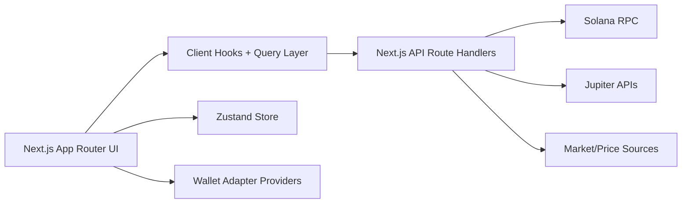
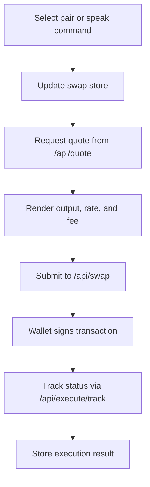

# Oraculum Dapp Overview

## Summary
Oraculum is a Solana trading dapp built with Next.js App Router, React, TypeScript, Tailwind CSS, Framer Motion, TanStack Query, Zustand, and the Solana wallet adapter stack.

The app combines:
- wallet connection
- live balances and portfolio data
- live market data
- Jupiter quote and swap execution
- wallet history and execution tracking
- voice-assisted swap intent parsing

The active app entry uses the Next.js `app/` directory.

## Product Goal
The dapp provides a premium trading terminal experience for Solana users with:
- manual token swapping
- live route and quote previews
- wallet-aware execution
- voice-assisted trade intent capture
- execution history and portfolio visibility

## Tech Stack
- Framework: Next.js 15
- UI: React 19
- Language: TypeScript
- Styling: Tailwind CSS
- Motion: Framer Motion
- Data fetching: TanStack Query
- Client state: Zustand with persistence
- Wallets: Solana Wallet Adapter
- Chain client: `@solana/web3.js`
- Routing backend integration: Next.js Route Handlers
- Voice input: browser Web Speech API

## Metadata And Branding
- App title: `Oraculum`
- Description: `Voice-assisted Solana trading terminal with live wallet, market, quote, and execution flows.`
- Root metadata file: `app/layout.tsx`
- Current app icon: `public/oraculum-icon.svg`

## High-Level Architecture

## Main User Flows
1. User opens the app and connects a wallet.
2. Wallet balances, portfolio summary, markets, and history are loaded from API routes.
3. User selects a swap pair manually or speaks a voice command.
4. The app updates swap state and requests a live quote.
5. User reviews route, output amount, slippage, and fees.
6. User signs the swap in the wallet.
7. The app tracks the submitted signature and stores execution state locally.

## App Providers
The global providers live in `src/components/providers/app-providers.tsx`.

They configure:
- `ConnectionProvider` for Solana RPC
- `WalletProvider` with `PhantomWalletAdapter` and `SolflareWalletAdapter`
- `WalletModalProvider` for wallet UI
- `QueryClientProvider` for TanStack Query
- `Toaster` for notifications

RPC default source:
- `DEFAULT_RPC_URL` from `src/lib/constants.ts`

## App Routes
The main app pages live under `app/`.

### Pages
- `/` -> home swap dashboard
- `/portfolio` -> portfolio overview
- `/markets` -> market overview
- `/orders` -> order/execution states
- `/history` -> wallet and execution history
- `/voice` -> voice console
- `/settings` -> trading and app settings

### Navigation Source
Navigation items are defined in `src/lib/nav.ts`.

## API Routes
The server-side API routes live under `app/api/`.

### Wallet
- `/api/wallet/balances`
- `/api/wallet/portfolio`
- `/api/wallet/history`

### Markets
- `/api/markets/list`

### Trading
- `/api/quote`
- `/api/swap`
- `/api/execute/track`

### Voice
- `/api/voice/parse`

## State Management
The main client store is `src/store/oraculum-store.ts`.

### Persisted State
- `swapInputMint`
- `swapOutputMint`
- `swapAmount`
- `slippageBps`
- `priorityFee`
- `lastIntent`
- `executions`

### Core Store Actions
- `setSwapPair(inputMint, outputMint)`
- `setSwapAmount(amount)`
- `setSlippage(slippageBps)`
- `setPriorityFee(priorityFee)`
- `setLastIntent(intent)`
- `upsertExecution(execution)`

### Default Swap State
- input mint: SOL
- output mint: USDC
- amount: `1`
- slippage: `50` bps
- priority fee: `auto`

## Query Layer
Client data hooks are implemented in `src/hooks/use-oraculum-data.ts`.

### Hooks
- `useMarkets()`
- `useWalletBalances(walletAddress)`
- `usePortfolio(walletAddress)`
- `useHistory(walletAddress)`
- `useQuote(request)`

### Behavior
- market queries refresh every 30 seconds
- wallet and portfolio queries refresh every 20 seconds
- quotes refresh aggressively for trading UX

## Main UI Composition
The page composition lives in `src/components/pages/app-pages.tsx`.

### Home Page
The home screen is `SwapHomePage()`.

It shows:
- top protocol header
- live stat grid
- `VoiceButton`
- `SwapCard`

### Portfolio Page
The portfolio route shows:
- wallet summary cards
- asset allocation
- top movers

### Markets Page
The markets route is designed for:
- tracked token market rows
- pair detail and liquidity context

### Orders Page
The orders route is for:
- execution states
- submitted and tracked swap records

### History Page
The history route is for:
- wallet transaction activity
- app execution ledger

### Voice Page
The voice route provides:
- microphone input
- transcript editing
- parsed intent fields
- handoff to swap terminal

### Settings Page
The settings route is for:
- swap pair defaults
- slippage
- priority fee preferences
- wallet and network display settings

## Swap System
The main swap UI lives in `src/components/swap/swap-card.tsx`.

### Swap Card Responsibilities
- reads current swap pair and amount from Zustand
- loads token balances and market data
- requests a live quote from `/api/quote`
- displays:
  - you pay token
  - you receive token
  - rate
  - slippage
  - estimated network fee
- builds a swap transaction through `/api/swap`
- submits with wallet adapter
- tracks status through `/api/execute/track`

### Swap Direction
The card uses:
- `swapInputMint` for `You Pay`
- `swapOutputMint` for `You Receive`

This is important for voice flow because parsed symbols must correctly map to:
- input token -> `You Pay`
- output token -> `You Receive`

## Voice System
The voice feature uses:
- `src/hooks/use-speech-recognition.ts`
- `src/components/voice/voice-button.tsx`
- `app/api/voice/parse/route.ts`
- `src/lib/server/voice.ts`

### How Voice Works
1. User taps the microphone.
2. Browser Web Speech API captures speech and returns transcript text.
3. Transcript is shown in the UI.
4. Final transcript is posted to `/api/voice/parse`.
5. The server parses the command into a `VoiceIntent`.
6. The app stores:
   - last intent
   - swap amount
   - swap pair
7. The swap card updates automatically if both symbols map correctly.

### Voice UI Entry Points
- Home widget: `src/components/voice/voice-button.tsx`
- Full console: `VoiceRoutePage()` in `src/components/pages/app-pages.tsx`

### Voice Parsing
Voice parsing is rule-based in `src/lib/server/voice.ts`.

Supported actions:
- `swap`
- `buy`
- `sell`
- `send`
- `stake`
- `unknown`

### Voice Alias Handling
The parser normalizes spoken names into trade symbols, including examples like:
- `solana` -> `SOL`
- `sulana` -> `SOL`
- `usd` -> `USDC`
- `usd coin` -> `USDC`
- `jupiter` -> `JUP`

### Current Voice Safety Model
- no blind auto-execution
- user must still review the swap
- wallet signature remains manual

## Trading Execution Flow

## Main Data Types
The shared dapp types live in `src/types/dapp.ts`.

### Important Types
- `WalletBalance`
- `PortfolioSummary`
- `MarketRow`
- `HistoryItem`
- `QuoteRequest`
- `QuoteResponse`
- `SwapBuildResponse`
- `ExecutionStatus`
- `VoiceIntent`

## Supported Tokens
Tracked token definitions live in `src/lib/constants.ts`.

Core featured tokens include:
- SOL
- USDC
- JUP
- BONK
- PYTH
- JTO
- WIF

The same constants file also exposes:
- mint addresses
- `FEATURED_TOKENS`
- `SYMBOL_TO_MINT`
- default RPC URL

## Current Design Language
The dapp follows a premium editorial trading-terminal style with:
- warm paper background
- serif headings
- terminal-like uppercase labels
- luxury green accent
- dense card layout
- polished shadows and gradients

## Important Files
### App Entry
- `app/layout.tsx`
- `app/page.tsx`

### UI Pages
- `src/components/pages/app-pages.tsx`
- `src/components/layout/app-shell.tsx`

### Swap
- `src/components/swap/swap-card.tsx`

### Voice
- `src/components/voice/voice-button.tsx`
- `src/hooks/use-speech-recognition.ts`
- `src/lib/server/voice.ts`
- `app/api/voice/parse/route.ts`

### State And Data
- `src/store/oraculum-store.ts`
- `src/hooks/use-oraculum-data.ts`
- `src/types/dapp.ts`

### Providers
- `src/components/providers/app-providers.tsx`

## Notes
- The active runtime app is the Next.js `app/` implementation.
- There are older TanStack Router files in `src/routes/`, but the main dapp flow is represented by the Next.js pages and route handlers.
- Voice recognition depends on browser support for `SpeechRecognition` or `webkitSpeechRecognition`.
- The dapp persists swap settings and execution records in local storage through Zustand persistence.

## One-Line Description
Oraculum is a voice-assisted Solana swap terminal that combines wallet connectivity, live market/portfolio data, Jupiter-powered trading, and a premium trading-dashboard UI in one Next.js dapp.
