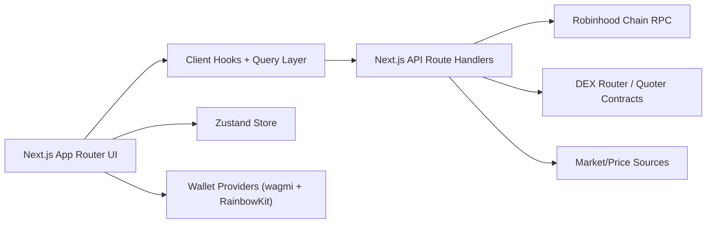
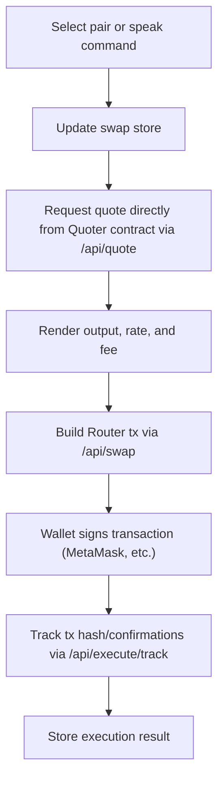

# Oraculum Dapp Overview (Migration Spec: Solana → Robinhood Chain)

> This file is a rewrite of the original Solana-based `DAPP_OVERVIEW.md`, updated to reflect a migration to **Robinhood Chain** and a **new dark, minimal fintech design language**. Hand this file to an AI coding IDE (Claude Code, Cursor, etc.) as the spec for the migration. The **mechanism / user flows / file structure stay the same** — only the chain-specific stack, data types, and visual design change.

## Summary

Oraculum is a trading dapp built with Next.js App Router, React, TypeScript, Tailwind CSS, Framer Motion, TanStack Query, Zustand, and an EVM wallet stack (wagmi + RainbowKit), now targeting **Robinhood Chain** instead of Solana.

The app combines:

- wallet connection (MetaMask + other EVM wallets)
- live balances and portfolio data
- live market data
- direct Uniswap-style router swap execution (no aggregator API)
- wallet history and execution tracking
- voice-assisted swap intent parsing

The active app entry uses the Next.js `app/` directory.

## Product Goal

The dapp provides a premium trading terminal experience for Robinhood Chain users with:

- manual token swapping via direct DEX router calls
- live route and quote previews
- wallet-aware execution
- voice-assisted trade intent capture
- execution history and portfolio visibility

## Chain Migration Notes

### From → To

| Concern           | Old (Solana)                              | New (Robinhood Chain)                                                                                    |
| ----------------- | ----------------------------------------- | -------------------------------------------------------------------------------------------------------- |
| Chain type        | Solana L1                                 | EVM, Arbitrum-based L2                                                                                   |
| Chain ID          | n/a                                       | `4663` (mainnet)                                                                                         |
| Gas token         | SOL                                       | ETH                                                                                                      |
| Chain client      | `@solana/web3.js`                         | `viem`                                                                                                   |
| Wallet stack      | Solana Wallet Adapter (Phantom, Solflare) | `wagmi` + `RainbowKit`                                                                                   |
| Supported wallets | Phantom, Solflare                         | MetaMask, WalletConnect, Coinbase Wallet, Rabby, and other RainbowKit-supported connectors               |
| Swap engine       | Jupiter quote/swap API                    | Direct on-chain calls to a Uniswap-style Router/Quoter contract                                          |
| Token identifier  | `mint` address                            | `contract address` (ERC-20)                                                                              |
| RPC               | Solana RPC endpoint                       | Robinhood Chain RPC (recommended provider: Alchemy; also QuickNode, Blockdaemon, dRPC, Validation Cloud) |
| Public RPC URL    | n/a                                       | `https://rpc.mainnet.chain.robinhood.com`                                                                |
| Explorer          | Solana explorer                           | Robinhood Chain Blockscout explorer                                                                      |

### Wallet Connection

- Library: `wagmi` for state/hooks, `RainbowKit` for the connect modal/UI
- MetaMask is a first-class supported connector, alongside WalletConnect, Coinbase Wallet, and others RainbowKit ships by default
- Network add/switch flow should use `wallet_addEthereumChain` under the hood (RainbowKit handles this) so users on the wrong network get prompted to add/switch to Robinhood Chain automatically
- No more `PhantomWalletAdapter` / `SolflareWalletAdapter` — remove entirely

### Swap Engine (Direct Router Calls)

- Replace all Jupiter quote/swap/route logic with direct calls to a Uniswap-style Router and Quoter contract deployed on Robinhood Chain
- Quote fetching: call the Quoter contract's `quoteExactInputSingle` (or equivalent) directly via `viem`, no external aggregator API
- Swap execution: build and submit a transaction to the Router contract's `exactInputSingle` / `swapExactTokensForTokens` (or equivalent) method, signed via the connected wallet
- Slippage and fee logic move from Jupiter's route metadata to manual slippage-bps calculation against the router quote
- Route "hops" (if supporting multi-hop) should be encoded manually via the router's path encoding, not fetched from an aggregator

## Tech Stack

- Framework: Next.js 15
- UI: React 19
- Language: TypeScript
- Styling: Tailwind CSS
- Motion: Framer Motion
- Data fetching: TanStack Query
- Client state: Zustand with persistence
- Wallets: `wagmi` + `RainbowKit`
- Chain client: `viem`
- Routing backend integration: Next.js Route Handlers
- Voice input: browser Web Speech API

## Metadata And Branding

- App title: `Oraculum`
- Description: `Voice-assisted Robinhood Chain trading terminal with live wallet, market, quote, and execution flows.`
- Root metadata file: `app/layout.tsx`
- Current app icon: `public/oraculum-icon.svg` (to be redesigned to match new dark fintech visual language)

## High-Level Architecture

## Main User Flows

1. User opens the app and connects a wallet (MetaMask or other EVM wallet via RainbowKit).
2. If on the wrong network, the app prompts the user to add/switch to Robinhood Chain.
3. Wallet balances, portfolio summary, markets, and history are loaded from API routes.
4. User selects a swap pair manually or speaks a voice command.
5. The app updates swap state and requests a live quote directly from the Quoter contract.
6. User reviews route, output amount, slippage, and fees.
7. User signs the swap transaction in the wallet.
8. The app tracks the submitted transaction hash and stores execution state locally.

## App Providers

The global providers live in `src/components/providers/app-providers.tsx`.

They configure:

- `WagmiProvider` for Robinhood Chain connection state
- `RainbowKitProvider` for wallet connect UI (MetaMask, WalletConnect, Coinbase Wallet, etc.)
- `QueryClientProvider` for TanStack Query
- `Toaster` for notifications

RPC default source:

- `DEFAULT_RPC_URL` from `src/lib/constants.ts` (Robinhood Chain RPC, e.g. Alchemy endpoint)

## App Routes

The main app pages live under `app/`. Route structure is unchanged.

### Pages

- `/` -> home swap dashboard
- `/portfolio` -> portfolio overview
- `/markets` -> market overview
- `/orders` -> order/execution states
- `/history` -> wallet and execution history
- `/voice` -> voice console
- `/settings` -> trading and app settings

### Navigation Source

Navigation items are defined in `src/lib/nav.ts`.

## API Routes

The server-side API routes live under `app/api/`. Route structure is unchanged; internals now call Robinhood Chain RPC / contracts instead of Solana RPC / Jupiter.

### Wallet

- `/api/wallet/balances`
- `/api/wallet/portfolio`
- `/api/wallet/history`

### Markets

- `/api/markets/list`

### Trading

- `/api/quote` — now calls the Quoter contract directly via `viem`
- `/api/swap` — now builds a Router contract transaction
- `/api/execute/track` — now tracks EVM transaction hash + confirmations instead of a Solana signature

### Voice

- `/api/voice/parse`

## State Management

The main client store is `src/store/oraculum-store.ts`. Shape is unchanged.

### Persisted State

- `swapInputMint` → conceptually becomes `swapInputToken` (ERC-20 contract address)
- `swapOutputMint` → `swapOutputToken` (ERC-20 contract address)
- `swapAmount`
- `slippageBps`
- `priorityFee` → EVM equivalent is gas price / priority fee (EIP-1559 `maxPriorityFeePerGas`)
- `lastIntent`
- `executions`

### Core Store Actions

- `setSwapPair(inputToken, outputToken)`
- `setSwapAmount(amount)`
- `setSlippage(slippageBps)`
- `setPriorityFee(priorityFee)`
- `setLastIntent(intent)`
- `upsertExecution(execution)`

### Default Swap State

- input token: ETH
- output token: USDC (bridged/native to Robinhood Chain)
- amount: `1`
- slippage: `50` bps
- priority fee: `auto`

## Query Layer

Client data hooks are implemented in `src/hooks/use-oraculum-data.ts`. Hook names/behavior unchanged.

### Hooks

- `useMarkets()`
- `useWalletBalances(walletAddress)`
- `usePortfolio(walletAddress)`
- `useHistory(walletAddress)`
- `useQuote(request)` — now sources quotes from direct Quoter contract reads

### Behavior

- market queries refresh every 30 seconds
- wallet and portfolio queries refresh every 20 seconds
- quotes refresh aggressively for trading UX

## Main UI Composition

The page composition lives in `src/components/pages/app-pages.tsx`. Page responsibilities unchanged; visual design changes (see Design Language section).

### Home Page

The home screen is `SwapHomePage()`. Shows top protocol header, live stat grid, `VoiceButton`, `SwapCard`.

### Portfolio Page

Wallet summary cards, asset allocation, top movers.

### Markets Page

Tracked token market rows, pair detail and liquidity context.

### Orders Page

Execution states, submitted and tracked swap records.

### History Page

Wallet transaction activity, app execution ledger.

### Voice Page

Microphone input, transcript editing, parsed intent fields, handoff to swap terminal.

### Settings Page

Swap pair defaults, slippage, priority fee preferences, wallet and network display settings.

## Swap System

The main swap UI lives in `src/components/swap/swap-card.tsx`.

### Swap Card Responsibilities

- reads current swap pair and amount from Zustand
- loads token balances and market data
- requests a live quote directly from the Quoter contract via `/api/quote`
- displays:
  - you pay token
  - you receive token
  - rate
  - slippage
  - estimated network fee (gas, in ETH)
- builds a swap transaction against the Router contract through `/api/swap`
- submits with the connected EVM wallet (MetaMask, etc.)
- tracks status through `/api/execute/track` by polling transaction receipt/confirmations

### Swap Direction

The card uses:

- `swapInputToken` for `You Pay`
- `swapOutputToken` for `You Receive`

This is important for voice flow because parsed symbols must correctly map to:

- input token -> `You Pay`
- output token -> `You Receive`

## Voice System

The voice feature uses:

- `src/hooks/use-speech-recognition.ts`
- `src/components/voice/voice-button.tsx`
- `app/api/voice/parse/route.ts`
- `src/lib/server/voice.ts`

### How Voice Works

1. User taps the microphone.
2. Browser Web Speech API captures speech and returns transcript text.
3. Transcript is shown in the UI.
4. Final transcript is posted to `/api/voice/parse`.
5. The server parses the command into a `VoiceIntent`.
6. The app stores:
   - last intent
   - swap amount
   - swap pair
7. The swap card updates automatically if both symbols map correctly.

### Voice UI Entry Points

- Home widget: `src/components/voice/voice-button.tsx`
- Full console: `VoiceRoutePage()` in `src/components/pages/app-pages.tsx`

### Voice Parsing

Voice parsing is rule-based in `src/lib/server/voice.ts`.

Supported actions:

- `swap`
- `buy`
- `sell`
- `send`
- `stake`
- `unknown`

### Voice Alias Handling

The parser normalizes spoken names into trade symbols. Aliases update to reflect the new token set, e.g.:

- `ethereum` -> `ETH`
- `usd` -> `USDC`
- `usd coin` -> `USDC`
- (Solana-specific aliases like `solana`/`sulana` -> `SOL` and `jupiter` -> `JUP` are removed)

### Current Voice Safety Model

- no blind auto-execution
- user must still review the swap
- wallet signature remains manual

## Trading Execution Flow

## Main Data Types

The shared dapp types live in `src/types/dapp.ts`. Types are renamed/reshaped for EVM:

### Important Types

- `WalletBalance` — now keyed by ERC-20 contract address instead of mint
- `PortfolioSummary`
- `MarketRow`
- `HistoryItem` — now represents EVM tx history (hash, block, gas used)
- `QuoteRequest` — now includes router/quoter contract params (tokenIn, tokenOut, fee tier, amountIn)
- `QuoteResponse` — now reflects direct on-chain quote result, not Jupiter route metadata
- `SwapBuildResponse` — now an unsigned EVM transaction object (to, data, value, gas)
- `ExecutionStatus` — now tracks EVM tx hash + confirmation count
- `VoiceIntent`

## Supported Tokens

Tracked token definitions live in `src/lib/constants.ts`.

Core featured tokens include:

- ETH
- USDC
- Robinhood Stock Tokens (as available on Robinhood Chain)
- other ERC-20s as desired

The same constants file also exposes:

- ERC-20 contract addresses
- `FEATURED_TOKENS`
- `SYMBOL_TO_ADDRESS` (replaces `SYMBOL_TO_MINT`)
- default RPC URL (Robinhood Chain)

## New Design Language: Dark, Minimal Fintech (Robinhood-esque)

Replacing the previous "premium editorial / paper background / serif / luxury green" style entirely with a **dark, minimal fintech** aesthetic:

- **Background:** near-black / deep charcoal base (not pure black), subtle elevation via slightly lighter dark surfaces for cards
- **Typography:** clean geometric sans-serif throughout (no serif headings); tight letter-spacing on numerals for a data-forward feel
- **Accent color:** a single confident accent (e.g. Robinhood-style green or a chain-appropriate accent) used sparingly for positive states, CTAs, and active elements — not decoratively
- **Negative/positive states:** clear red/green semantic coloring for price moves, P&L, and execution status
- **Layout:** minimal chrome, generous whitespace within a dark canvas, flat cards with soft low-opacity borders rather than heavy shadows/gradients
- **Data density:** numbers and tickers presented cleanly — tabular alignment, monospaced or tabular-figure numerals for prices/balances
- **Motion:** subtle, fast Framer Motion transitions (fade/slide) — avoid ornate or slow animation that reads as "luxury/editorial"
- **Iconography:** simple line icons, no ornamental flourishes
- **No more:** warm paper background, serif headings, terminal uppercase labels as a primary motif, dense ornamental shadows/gradients

This should be applied consistently across all pages (`app-pages.tsx`), the shell (`app-shell.tsx`), the swap card, and the app icon (`public/oraculum-icon.svg` should be redesigned to match).

## Important Files

### App Entry

- `app/layout.tsx`
- `app/page.tsx`

### UI Pages

- `src/components/pages/app-pages.tsx`
- `src/components/layout/app-shell.tsx`

### Swap

- `src/components/swap/swap-card.tsx`

### Voice

- `src/components/voice/voice-button.tsx`
- `src/hooks/use-speech-recognition.ts`
- `src/lib/server/voice.ts`
- `app/api/voice/parse/route.ts`

### State And Data

- `src/store/oraculum-store.ts`
- `src/hooks/use-oraculum-data.ts`
- `src/types/dapp.ts`

### Providers

- `src/components/providers/app-providers.tsx`

## Notes

- The active runtime app is the Next.js `app/` implementation.
- There are older TanStack Router files in `src/routes/`, but the main dapp flow is represented by the Next.js pages and route handlers.
- Voice recognition depends on browser support for `SpeechRecognition` or `webkitSpeechRecognition`.
- The dapp persists swap settings and execution records in local storage through Zustand persistence.
- Robinhood Chain reference: Chain ID `4663`, EVM/Arbitrum L2, ETH gas token, recommended RPC provider Alchemy (also QuickNode, Blockdaemon, dRPC, Validation Cloud). Docs: https://docs.robinhood.com/chain/connecting/

## One-Line Description

Oraculum is a voice-assisted Robinhood Chain swap terminal that combines EVM wallet connectivity (MetaMask and others), live market/portfolio data, direct on-chain DEX router trading, and a dark, minimal fintech dashboard UI in one Next.js dapp.
